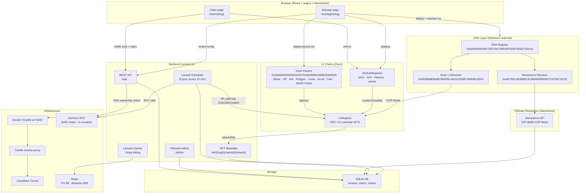
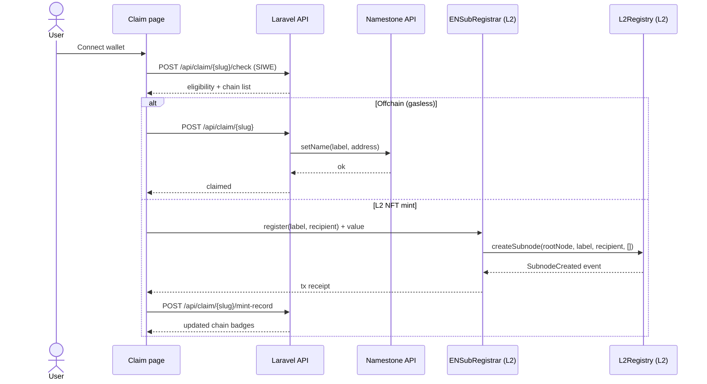
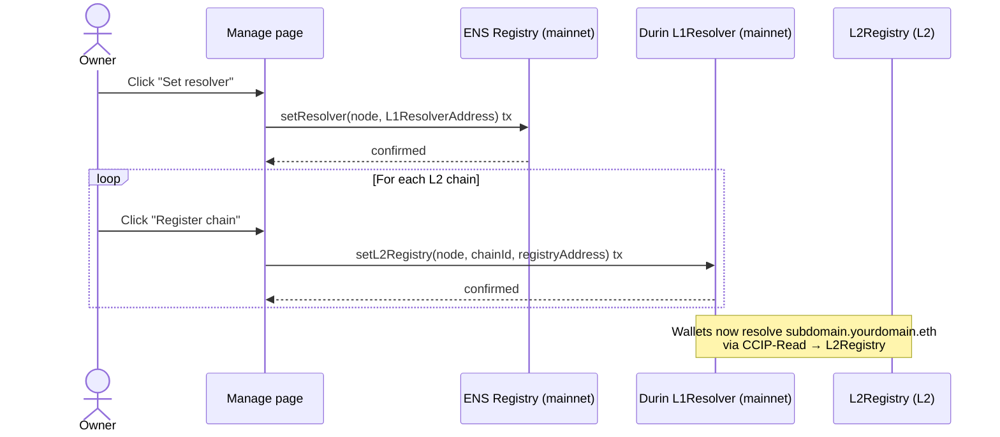
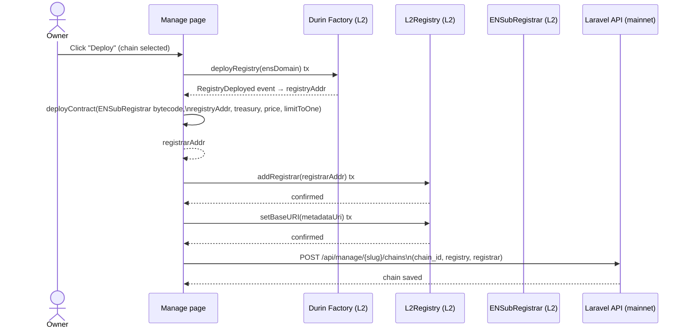
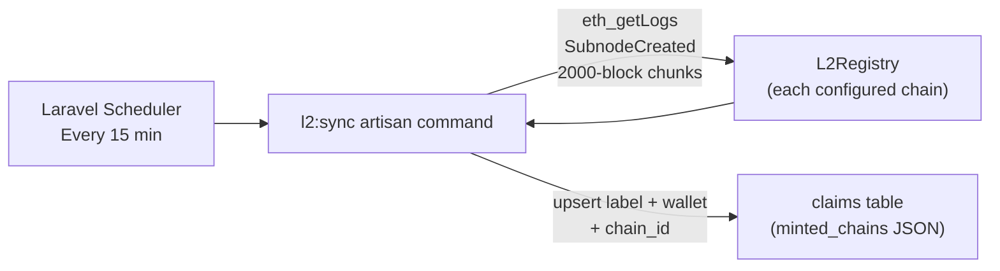

# ENSub

**Gasless ENS subdomain manager** — lets any ENS domain owner launch a token-gated subdomain claim page in minutes. No code, no gas fees.

🌐 **Live:** https://www.ensub.org

---

## What it does

ENSub gives any  **ENS** domain owner a fully branded subdomain claim page at `ensub.org/claim/yourname`. Visitors connect their wallet and claim a free `*.yourdomain.eth` subdomain — gaslessly via Namestone, and optionally as an on-chain NFT on any supported L2 via [Durin](https://durin.dev).

---

## Architecture overview



---

## Claim flow



---

## ENS resolver setup flow



---

## ENSubRegistrar deploy flow



---

## L2 sync (cross-chain indexer)



---

## Stack

| Layer | Tech |
|---|---|
| Backend | Laravel 11 + Filament 3 (admin panel) |
| Frontend | Inertia.js + React + Vite |
| Wallets | RainbowKit + wagmi v2 + viem |
| Auth | SIWE (Sign In With Ethereum) |
| ENS | On-chain ownership checks via Alchemy + EIP-137 namehash |
| Namestone | Gasless offchain subdomain resolver API |
| Durin | L2 subdomain NFT contracts (L2Registry + ENSubRegistrar) |
| Billing | Laravel Cashier + Stripe (Pro $9/mo, Business $29/mo) |
| DB | SQLite (persistent volume on NAS) |
| Deploy | Docker → Coolify (NAS) → Cloudflare Tunnel |

---

## Resolver modes

ENSub tracks which ENS resolver is active for your domain. The two modes are **mutually exclusive** — switching to one disables the other at the protocol level.

| | Mode A — Namestone (default) | Mode B — L1Resolver (on-chain) |
|---|---|---|
| **Resolver** | `0xA87361c4…` (Namestone) | `0x8A968aB9…` (Durin L1Resolver) |
| **Resolution path** | ENS Registry → Namestone offchain CCIP-Read → DB | ENS Registry → L1Resolver → CCIP-Read → L2Registry (per chain) |
| **Gasless claims** | ✅ Active | ❌ Inactive (Namestone no longer authoritative) |
| **L2 NFT mints** | ✅ Claimants pay L2 gas | ✅ Claimants pay L2 gas |
| **Subdomain resolves in wallets** | Via Namestone DB record | Via on-chain L2Registry NFT |
| **Status badge** | 🔴 Offchain (Namestone) active | 🟢 On-chain resolution active |

**Switching modes** — done from the Manage page → ENS Resolution section:
- `Set resolver → L1Resolver` : one mainnet tx + one tx per L2 chain to register registries
- `↩ Revert to Namestone` : one mainnet tx; gasless claims resume

> ⚠️ Switching to L1Resolver disables Namestone — gasless-only claimants who have not minted on any L2 will stop resolving in wallets/dApps until you revert or they mint on-chain.

---

## Claim modes

### Ξ ETH — Gasless (Namestone)
Subdomains are resolved offchain through Namestone using EIP-3668 CCIP-Read. Zero on-chain transactions for claimants after the domain owner does a one-time resolver setup. Tracked in the `claims` DB table.

> Only available when resolver mode is **Namestone** (Mode A). The claim page hides this option automatically when L1Resolver is active.

### L2 NFT Minting (Durin)
Each L2 chain needs two deployed contracts:
- **L2Registry** — ERC-721 contract deployed via the Durin factory (`0xDddddDdDDD8Aa1f237b4fa0669cb46892346d22d`). Manages subnode records.
- **ENSubRegistrar** — custom registrar that calls `createSubnode()` on the registry with optional price, 1-per-wallet limit, pause, and treasury controls. An open (no-limit) registrar is also available.

The Manage page deploys both in one click (registry → registrar → authorize → set metadata URI). L2 mints are tracked in the `minted_chains` JSON column on each claim record. Each minted NFT returns metadata from the `/nft/{slug}/{chainId}/{tokenId}` endpoint.

**Supported L2s:** Base · Optimism · Arbitrum · Polygon · Linea · Scroll · Celo · World Chain

### ENS On-chain Resolution (Phase 2)
Once L2 chains are deployed, the Manage page guides the domain owner through two mainnet steps:
1. **Set resolver** — points the ENS domain at the pre-deployed Durin L1Resolver (`0x8A968aB9eb8C084FBC44c531058Fc9ef945c3D61`)
2. **Register L2 registries** — calls `setL2Registry(node, chainId, registryAddress)` on the L1Resolver for each chain

After this, `subdomain.yourdomain.eth` resolves on-chain via CCIP-Read from the L2Registry. A **↩ Revert to Namestone** button is available to switch back to the Namestone offchain resolver (`0xA87361C4E58B619c390f469B9E6F27d759715125`).

The full CCIP-Read resolution chain:
```
ENS Registry (mainnet)
  └─ L1Resolver.resolve(name)
       └─ CCIP-Read offchain call
            └─ iterate registered L2 chains
                 └─ L2Registry.ownerOf(tokenId)  →  claimant address
```

### L2 Cross-chain Sync (Phase 3)
`SubnodeCreated` events are indexed from each L2Registry via `php artisan l2:sync`. Runs every 15 minutes via Laravel Scheduler (supervisord in Docker). Chunks `eth_getLogs` in 2 000-block windows, falls back to public RPC when Alchemy free-tier block-range limit is hit. Syncs wallet address, subdomain label, and chain ID into the `claims` table — so mints done directly on-chain (bypassing the claim page) appear in the admin panel.

### ENSubRegistrar (Phase 4)
Custom L2 registrar contract (`contracts/src/ENSubRegistrar.sol`) with:
- **On-chain 1-per-wallet enforcement** — checks `registry.balanceOf(recipient) == 0` before allowing a mint
- **Configurable mint price** — set in wei; collected to a treasury address (defaults to deployer)
- **Excess payment refund** — only `price` is forwarded to treasury; any overpayment is returned to the sender
- **Pause / admin controls** — `setPaused`, `setPrice`, `setTreasury`, `setLimitToOne`, `transferOwnership`
- **`canRegister(wallet)`** — view function for UI pre-checks
- **Manage page controls** — price, treasury address, 1-per-wallet toggle, and pause accessible via ⚙ Settings per chain

---

## Smart contracts

### ENSubRegistrar (`contracts/src/ENSubRegistrar.sol`)

| Function | Visibility | Description |
|---|---|---|
| `register(label, recipient)` | `external payable` | Mint a subdomain NFT; enforces pause, price, 1-per-wallet |
| `canRegister(wallet)` | `external view` | Returns false if paused or wallet already holds a token |
| `setPrice(price)` | `onlyOwner` | Set mint price in wei (0 = free) |
| `setTreasury(address)` | `onlyOwner` | Set fee collection address |
| `setLimitToOne(bool)` | `onlyOwner` | Toggle 1-per-wallet enforcement |
| `setPaused(bool)` | `onlyOwner` | Pause / unpause minting |
| `transferOwnership(address)` | `onlyOwner` | Transfer admin |

**Constructor args:** `_registry` (L2Registry address), `_treasury`, `_price` (wei), `_limitToOne` (bool)

**IL2Registry interface** (Durin L2Registry):

```solidity
function createSubnode(bytes32 node, string calldata label, address _owner, bytes[] calldata data) external;
function baseNode() external view returns (bytes32);
function balanceOf(address owner) external view returns (uint256);
```

**Key addresses (all chains):**
- Durin Factory: `0xDddddDdDDD8Aa1f237b4fa0669cb46892346d22d`
- Durin L1Resolver: `0x8A968aB9eb8C084FBC44c531058Fc9ef945c3D61`
- Namestone Resolver: `0xA87361C4E58B619c390f469B9E6F27d759715125`
- ENS Registry (mainnet): `0x00000000000C2E074eC69A0dFb2997BA6C7d2e1e`

---

## Future enhancements

### XMTP web3 messaging
[XMTP](https://xmtp.org) (v3, MLS-based, quantum-resistant e2e encryption) is a strong candidate for adding wallet-to-wallet messaging to ENSub. The main use case would be project owners broadcasting messages to all their subdomain holders directly from the Manage page — no email required, wallet-native.

**Current blocker:** XMTP resolves root ENS names (`vitalik.eth`) and Base names but does **not** currently resolve ENS subdomains whose resolver implements EIP-3668 CCIP-Read. Tested on `xmtp.chat` — `alice.pixelgoblins.eth` returns invalid, raw wallet address works fine. A question has been raised on the XMTP forum requesting CCIP-Read subdomain support.

**When unblocked, planned phases:**
1. Claim page: optional "Activate web3 inbox" step after claiming (one wallet signature)
2. Manage page: "Message community" broadcast to all subdomain holders by wallet address
3. XMTP as an additional notification channel alongside email (plan changes, limit reached)
4. Token-gated group chat per ENS domain (MLS group, membership synced with claims)

Tracking: [xmtp.org/docs](https://docs.xmtp.org) · SDK: `@xmtp/browser-sdk` · Vite note: requires `optimizeDeps: { exclude: ['@xmtp/browser-sdk'] }`

---

## Known limitations

- **Revoke doesn't burn L2 NFT** — neither the Durin L2Registry nor the open L2Registrar has a burn function. Revoke on the Manage page removes the Namestone offchain record only; the on-chain NFT stays.
- **L2-only claimants** — if a user mints on L2 without doing the offchain step, there's no Namestone record. Subdomain resolves on-chain only after the L1Resolver phase is done.
- **Expiry/renewal** — ENSubRegistrar has no expiry. Permanent mints only.

---

## Onboarding flow

1. **Verify wallet** — SIWE nonce/signature to prove ENS ownership
2. **ENS domain** — checks on-chain ownership via Alchemy + ENS Registry
3. **Eligibility** — gate config: open / NFT / ERC-20 / allowlist
4. **Set resolver** — one-time on-chain tx to point ENS domain at Namestone's resolver; Name Wrapper aware; auto-skips if already set
5. **Namestone API key** — "Enable via wallet" SIWE sign → auto-populates API key

---

## Features

- **Multi-tenant** — each ENS owner gets their own branded claim page at `/claim/{slug}`
- **Gate types** — open, NFT (ETHscriptions/ERC-721), ERC-20 token, allowlist
- **Light/dark mode** — localStorage, toggled from nav
- **Animated background** — optional Vanta.js NET
- **Claim page** — `Ξ ETH` gasless row + one row per configured L2 chain; already-claimed wallets can mint on additional L2s; 1-per-wallet per chain enforced in UI
- **NFT metadata** — `GET /nft/{slug}/{chainId}/{tokenId}` returns ERC-721 metadata (name, description, image, chain attribute); tokenId resolved via keccak256 namehash
- **Manage page** (owner-only, wallet-verified):
  - Edit branding, gate config, Namestone API key, claim limit
  - L2 Chains: deploy contracts in-browser (1 click); enable/disable per chain; ⚙ Fix button redeploys and re-authorizes the registrar
  - ENS On-chain Resolution: set/revert resolver + register L2 registries on mainnet
  - Claims list: `Ξ ETH` badge + per-chain mint badges; per-row revoke
  - Share card (Twitter/X, Farcaster, copy link) · Embed widget (Pro/Business only)
- **Filament admin** at `/admin` — tenant management, claims list with L2 Mints column; Send Email action per tenant
- **Email system** — Lettr (lettr.com) via `mail.ensub.org`; DB-backed editable templates; plan change / cancellation auto-emails; newsletter broadcast; send test action
- **Notifications** — tenants set a notification email from the Manage page; used for plan change and future automated emails
- **Contact form** — "Get in Touch" collapsible form on Home page; sends to `mail@ensub.org`
- **Stripe billing** — Free: 50 claims · Pro: 500 · Business: unlimited

---

## Local dev

```bash
composer install
npm install --legacy-peer-deps
cp .env.example .env
php artisan key:generate
php artisan migrate
npm run dev
php artisan serve
```

**Required `.env` keys:**
```
ALCHEMY_KEY=
WALLETCONNECT_PROJECT_ID=
STRIPE_KEY=
STRIPE_SECRET=
STRIPE_WEBHOOK_SECRET=
STRIPE_PRICE_PRO=
STRIPE_PRICE_BUSINESS=
NAMESTONE_API_KEY=
MAIL_MAILER=lettr
MAIL_FROM_ADDRESS="hello@mail.ensub.org"
LETTR_API_KEY=
```

---

## Deployment (Coolify on NAS)

- Container port: 80, reverse-proxied via Traefik
- Cloudflare Tunnel exposes the app publicly
- Persistent SQLite on a mounted host volume
- `php artisan migrate` + `db:seed` run on each deploy (entrypoint.sh)
- L2 sync runs via Laravel Scheduler every 15 minutes inside the container (supervisord)

---

## Email system (Lettr)

- Provider: [Lettr](https://lettr.com) — free tier (3k/mo, 100/day)
- Sending domain: `mail.ensub.org` (SPF + DKIM + DMARC verified on Cloudflare)
- From address: `hello@mail.ensub.org`
- Contact destination: `mail@ensub.org` (alias → merloproductions@gmail.com)
- Templates stored in `email_templates` DB table — editable from Filament admin at `/admin/email-templates`
- Template types: `plan_upgraded_pro`, `plan_upgraded_business`, `plan_cancelled`, `admin_manual`, `newsletter`
- Supports `{placeholder}` substitution: `{tenant_name}`, `{tenant_domain}`, `{tenant_slug}`, `{new_plan}`, `{previous_plan}`, `{claim_limit}`, `{dashboard_url}`, `{body}`
- Newsletter: "Send to all" action broadcasts to all tenants with `billing_email` set
- Admin manual send: envelope icon on each tenant row in Filament

---

## Stripe webhook

- Endpoint: `https://www.ensub.org/stripe/webhook`
- Events: `customer.subscription.created`, `customer.subscription.updated`, `customer.subscription.deleted`

---

## GitHub

https://github.com/Echo-Merlini/ENSub
